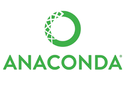

<h1 align="center">5x Machine Learning Apps-in-one</h1>

## Demo
- App Link : <a href="https://mlx2022.herokuapp.com/" target="_blank">mlx2022s</a>

## Overview
This [repository](https://github.com/SoumyaSwaraj/Machine-Learning/) consists of various machine learning projects in which each projects was done as end to end projects which means from Data Collection through feature engineering, feature selecion to Deployment and Maintainance. The whole app was built with Flask framework. You can launch my app by clicking <a href="https://mlx2022.herokuapp.com/" target="_blank">here</a>.

For building machine learning models, I have used scikit-learn alias sklearn.

The model was deployed on Heroku platform which is a platform-as-a-service.

## Projects Done
Here I have listed all the projects that I have done and strats from latest projects.

| Project No |          Project Name           |  Start Date  |   End Date  |           GitHub          |         Blog          | App Link |
|:-----------|:--------------------------------|:------------:|:-----------:|--------------------------:|----------------------:|---------:|
| 5.         | Boston Housing Price Prediction | 10-Jul-2020  | 11-Jul-2020 |[Boston Housing](https://github.com/SoumyaSwaraj/Machine-Learning//tree/master/05.Boston_House_Price_Prediction)|[Boston Housing](https://medium.com/@Ashok_kumar_K/boston-housing-price-prediction-e279074f356c?source=your_stories_page---------------------------)|-|
| 4.         | Loan Status Prediction | 01-Jul-2020  | 07-Jul-2020 |[Loan Status](https://github.com/SoumyaSwaraj/Machine-Learning//tree/master/02.Loan_Status_Prediction)|[Loan Status](https://medium.com/analytics-vidhya/loan-status-prediction-machine-learning-model-ca703246c7ec?source=your_stories_page---------------------------)|-|
| 3.         | Iris Species Classification | 27-Jun-2020  | 30-Jun-2020 |[Iris Species](https://github.com/SoumyaSwaraj/Machine-Learning//tree/master/01.Iris_Species_Classification)|[Iris Species](https://medium.com/analytics-vidhya/iris-species-classification-machine-learning-model-8d7fa4e48f81?source=your_stories_page---------------------------)|-|
| 2.         | Gender Classification | 18-Jan-2020  | 31-Jan-2020 |[Gender](https://github.com/SoumyaSwaraj/Machine-Learning//tree/master/03.Gender_Classifcation)|-|-|
| 1.         | Weight Prediction | 12-Jan-2020  | 17-Jan-2020 |[Weight](https://github.com/SoumyaSwaraj/Machine-Learning//tree/master/04.Weight_Prediction)|-|-|

## Technical Aspects
Since we can deploy atmost 5 app in Heroku as a free service, I came up with a new idea of deploying all my projects in a single web app and controlling the each projects navigation with Flask and Python.

Some extra-ordinary features that I have included in my app :
- Visualizing Probability of classifcation in each classification type problems.
- Added all the details about the projects such as data source, code source, libraries and frameworks used in each project's description.
- All my end to end projects in a single view.
`
## Technologies Used

